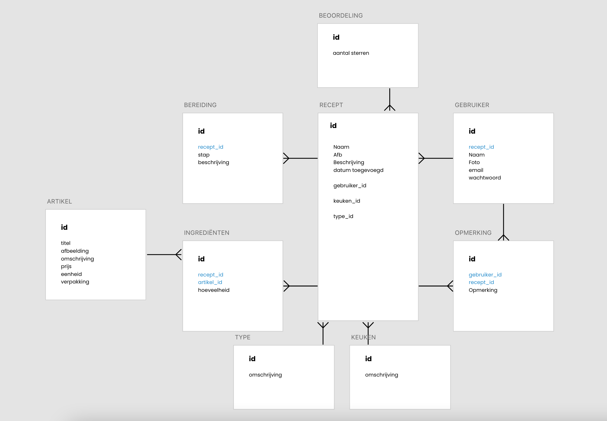
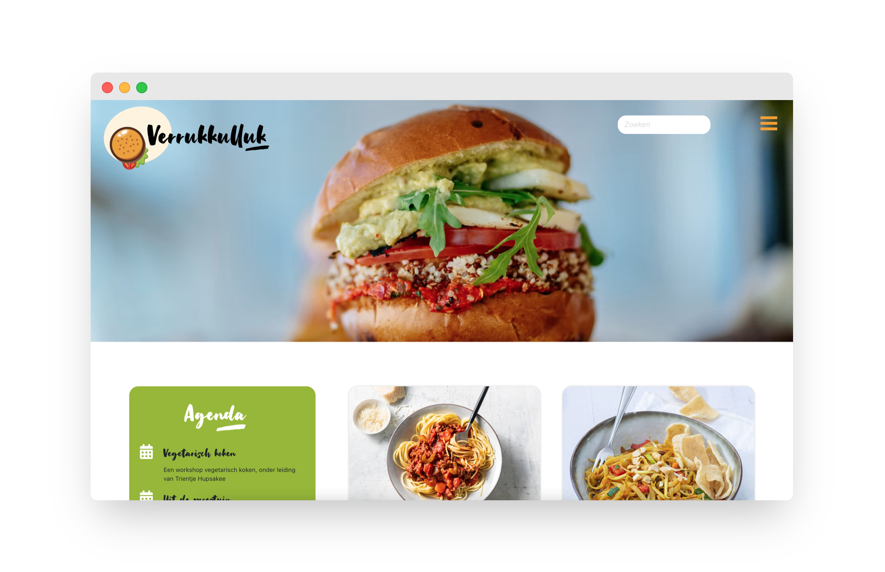
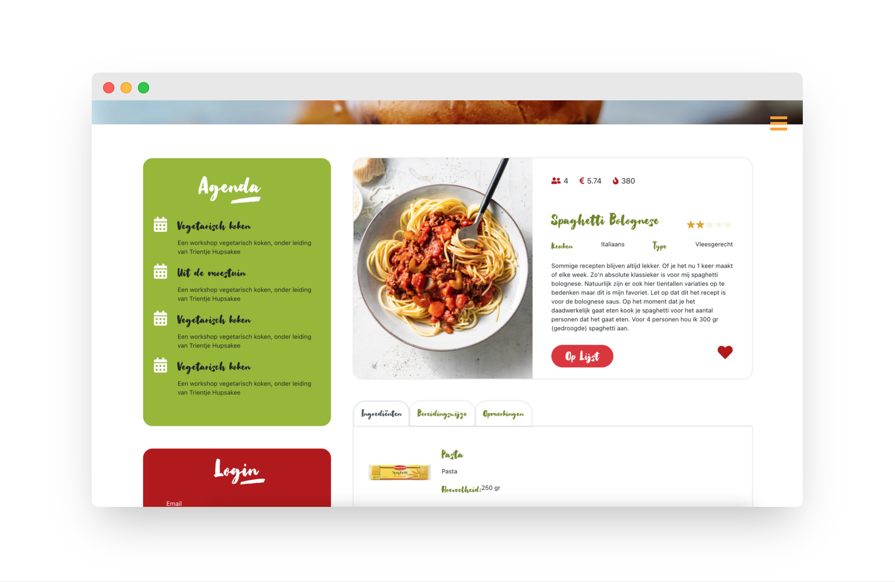

# Verrukkulluk front-end React.js

Dit project richt zich vooral op de front-end van de receptenwebsite Verrukkulluk. De case is bedoeld om React onder de knie te krijgen. De backend is in dit geval aangeleverd.

## Technologieën

De front-end applicatie is geschreven in React.js en middels een API wordt de data uit een PHP/Symfony backend opgehaald.

* React (met class components)
* JavaScript
* HTML
* CSS

## Methoden & Technieken

### Entity Relationship Diagram
Dit diagram toont het conceptueel datamodel. Het is een visuele weergave van de entiteiten, relaties en regels die gelden of aanwezig zijn.

## Prototype
Adobe XD Prototype: https://xd.adobe.com/embed/d364d780-09f9-4671-80bc-0e0973e7e112-8637/ 

## Screenshots project
Homepage

Detailpage
